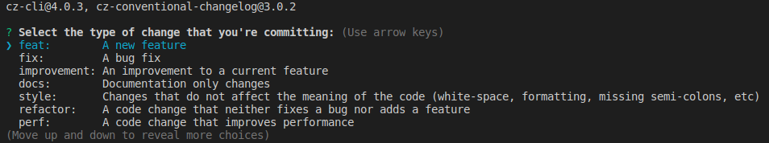

# standard-commit

Guidelines to standardize commit messages

[](LICENSE)

## Installation

- **commitlint** checks if your commit messages meet the [Conventional Commits](https://conventionalcommits.org/) specification
- **husky** will trigger the commitlint on each commit
- **commitizen** and **cz-conventional-changelog** helps format commit messages with a series of prompts
- **standard-version** will update CHANGELOG.md, bump the version and generate a new tag

### Step 1 - Install husky, commitlint, cz-conventional-changelog and standard-version locally

`yarn add --dev husky @commitlint/cli @commitlint/config-conventional cz-conventional-changelog standard-version`

### Step 2 - Install commitizen globally

`sudo yarn global add commitizen`

### Step 3 - Update package.json

```
{
  ...

  "scripts": {
    "release": "standard-version"
  },
  "husky": {
    "hooks": {
      "commit-msg": "commitlint -E HUSKY_GIT_PARAMS"
     }
  },
  "config": {
    "commitizen": {
      "path": "./node_modules/cz-conventional-changelog"
    }
  }

  ...
}
```

### Step 4 - Create a `commitlint.config.js` file in your project root directory

```
module.exports = {
  extends: ['@commitlint/config-conventional'],
}
```

### Step 5 - Configure commitizen

`commitizen init cz-conventional-changelog --save-dev --save-exact`

## Usage

Basically, instead of typing `git commit` now you type `git cz` which will open a wizard and help you write a standardized message.



### Commit with commitizen

Using commitizen to prompts a wizard.

```
git add .
git cz
yarn release
git push --follow-tags
```

#### Pro tip

Run this command in your first release to prevent bumping the version in `package.json`

`yarn release -- --first-release`

Prevent bumping the version:

```
git add .
git cz
yarn release -- --first-release
git push --follow-tags
```

You can also release a specific version:

```
git add .
git cz
yarn release --release-as 1.1.0
git push --follow-tags
```

### Normal commit command

You can still use `git commit ...` but the commit will fail if the commit message is not properly formatted.

```
git add .
git commit -m "feat(blog): add comment section"
yarn release
git push --follow-tags
```

### Commit but skip changelog, bump version and tag

```
git add .
git cz
yarn release --skip.changelog --skip.bump --skip.tag
git push
```

## Credits

- Git hooks - [husky](https://github.com/typicode/husky)
- Lint commit messages - [commitlint](https://github.com/conventional-changelog/commitlint)
- Commit messages - [commitizen](https://github.com/commitizen/cz-cli)
- Automate versioning - [standard-version](https://github.com/conventional-changelog/standard-version)

## Contributing

Want to contribute? All contributions are welcome. Read the [contributing guide](CONTRIBUTING.md).

## Questions

If you have questions tweet me at [@sandro_m_m](https://twitter.com/sandro_m_m) or [open an issue](../../issues/new).

## License

This project is licensed under the MIT License - see the [LICENSE](LICENSE) file for details

**~ sharing is caring ~**
