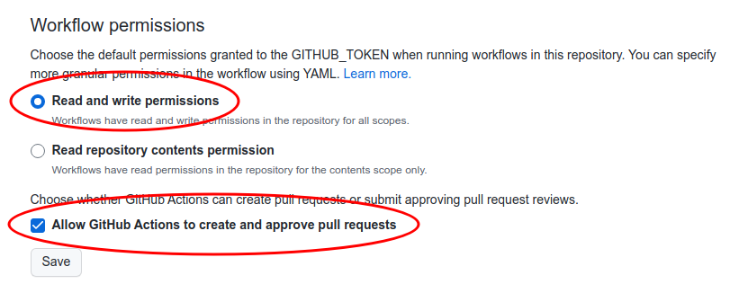

# Standard Commit

Guidelines to standardize commit messages

[](LICENSE)

## Features

- Validates commit messages against the [Conventional Commits](https://conventionalcommits.org/) specification.
- Formats commit messages using a series of prompts.
- Automates the generation of a CHANGELOG.md file.
- Bumps the version and generates a new release.

## Installation

### Step 1 - Install Dependencies

Install the necessary dependencies locally:

```sh
yarn add --dev husky @commitlint/cli @commitlint/config-conventional cz-conventional-changelog
```

### Step 2 - Install commitizen globally

Install commitizen globally to enable standardized commit message formatting:

```sh
sudo yarn global add commitizen
```

### Step 3 - Update `package.json`

Update your project's `package.json` file to configure commitizen:

```
{
  ...

  "config": {
    "commitizen": {
        "path": "./node_modules/cz-conventional-changelog",
        "disableScopeLowerCase": true
    }
  },

  ...
}
```

### Step 4 - Configure Commitlint

Create a `commitlint.config.js` file in your project root directory to configure commitlint:

```js
module.exports = {
  extends: ["@commitlint/config-conventional"],
  rules: {
    "scope-case": [0],
  },
};
```

### Step 5 - Setup husky

Edit `package.json > prepare` script and run it once:

```sh
npm pkg set scripts.prepare="husky install"
yarn prepare
```

Add a hook to run commitlint

```sh
npx husky add .husky/commit-msg "yarn commitlint --edit"
```

### Step 6 - Configure commitizen

Configure commitizen to use the conventional changelog adapter:

```sh
commitizen init cz-conventional-changelog --save-dev --save-exact
```

### Step 7 - Setup Release Please

Automate release management with Release Please:

#### Deploy release-please with GitHub Action by creating a `.github/workflows/release-please.yml` file with these contents:

```
on:
    push:
        branches:
            - main
name: release-please
jobs:
    release-please:
        runs-on: ubuntu-latest
        steps:
            - uses: google-github-actions/release-please-action@v3
              with:
                  release-type: node
                  package-name: release-please-action
```

#### Make sure you have the correct _Workflow permissions_ on your repository (Settings > Actions > General):



## Usage

Standard Commit simplifies the process of writing standardized commit messages:


### Using Commitizen

Instead of `git commit`, use `git cz` to open a wizard and generate a standardized commit message:

```sh
git add .
git cz
git push --follow-tags
```

### Normal commit command

You can still use `git commit ...` but the commit will fail if the commit message is not properly formatted.

```sh
git add .
git commit -m "feat(blog): add comment section"
git push --follow-tags
```

## Credits

- [commitizen](https://github.com/commitizen/cz-cli) helps format commit messages with a series of prompts
- [husky](https://github.com/typicode/husky) will trigger the commitlint on each commit
- [commitlint](https://github.com/conventional-changelog/commitlint) checks if your commit messages meet the [Conventional Commits](https://conventionalcommits.org/) specification
- [release-please](https://github.com/googleapis/release-please) automates `CHANGELOG.md`, bump the version and generate a new release

## Contributing

Want to contribute? All contributions are welcome. Read the [contributing guide](CONTRIBUTING.md).

## Questions

If you have questions tweet me at [@sandro_m_m](https://twitter.com/sandro_m_m) or [open an issue](../../issues/new).

## License

This project is licensed under the MIT License - see the [LICENSE](LICENSE) file for details

**~ sharing is caring ~**
